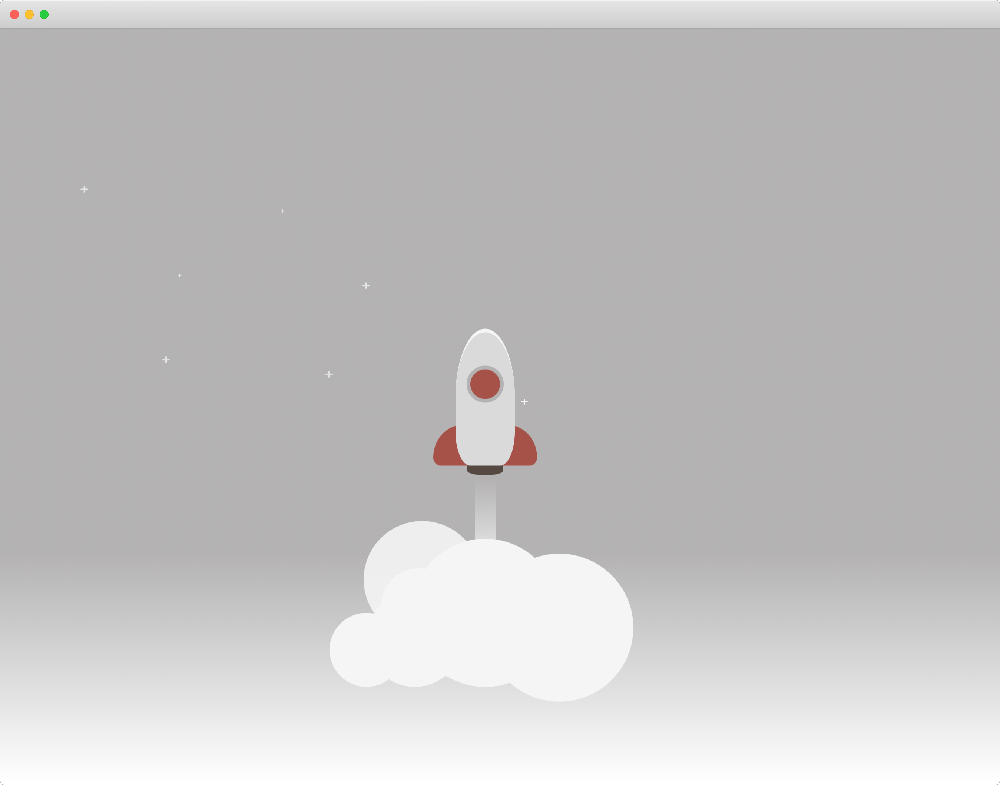

# Rocket Ship Pairing/Small Coding Challenge 🚀

### Difficulty: < 10 minutes

# Requirements
- Stop the Class rocket from taking off
- Stop the Functional rocket from taking off

# Think about
- How we prevent components from re-rendering

